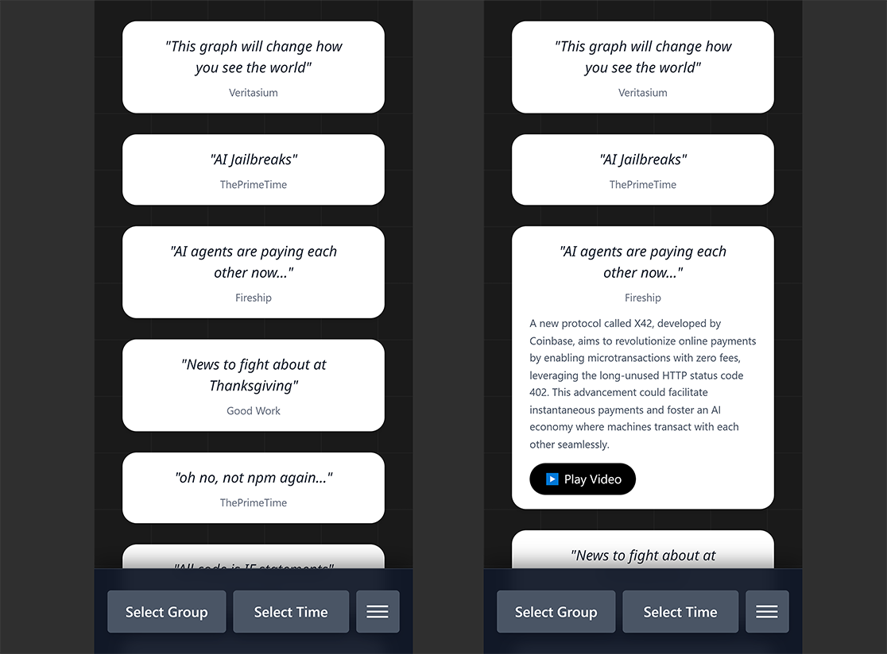

# Personalized YouTube Feed Builder

A web application that lets users build a **personalized YouTube feed** by curating channels themselves instead of relying on algorithmic recommendations.

Users organize channels into groups, filter by time range, and optionally generate AI-assisted video summaries.

---

## 🔧 Tech Stack

- Next.js (App Router)
- NextAuth (GitHub / Google)
- PostgreSQL
- Prisma
- YouTube RSS feeds
- OpenAI API (summaries)

---

## 📺 Core User Flow

- Users add channels by pasting **any YouTube video URL**
- Channels can be grouped into user-defined folders
- Users can create and delete groups freely
- The feed page allows:
  - Selecting one or more groups
  - Filtering videos by time window (e.g. last 2 / 7 / 15 / 30 days)
  - Viewing a consolidated feed sorted by recency

---

## 🔐 Authentication & Access

- Authentication via NextAuth (GitHub / Google)
- Unauthenticated users are redirected to a login page

---

## 🧠 Feed Generation

- The backend reads the user’s saved channel list from the database
- Each channel’s YouTube RSS feed is fetched
- Videos are filtered by the selected time window
- Results are merged and sorted newest-first

This keeps feed generation simple and transparent.

---

## ✨ Transcript & AI Summary

- Each video can be expanded and played inline
- A short transcript snippet is fetched for the video
- An AI-generated summary is created from the transcript
- Transcript and summary results are cached locally in the browser

This allows quick scanning without watching the full video.

---

## 🗄️ Data Model

The database schema includes:

- **User** – authenticated user
- **Link** – saved YouTube channels per user
- **Group** – user-defined channel groups
- Many-to-many relationship between groups and channels

---

## 🎯 Purpose

This project was built to practice:

- Auth-protected Next.js applications
- User-curated content feeds
- External data aggregation (RSS)
- Client/server coordination for derived data
- Lightweight AI-assisted UX features

---

